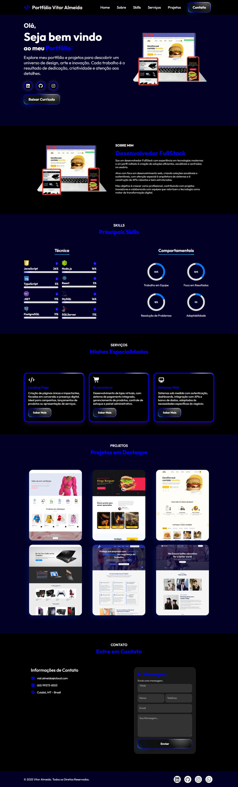

# Portfólio 
Portfólio Profissional - Vitor Almeida 🧑‍💼

# Descrição do Projeto 🚀
Este é um projeto de portfólio profissional desenvolvido com React e TypeScript, com o objetivo de apresentar minhas habilidades, experiências e projetos como Desenvolver FullStack. 

## Estrutura do Projeto 📁
O projeto é organizado em componentes reutilizáveis, com foco em performance, acessibilidade e boas práticas de desenvolvimento front-end.

## Funcionalidades 📌
- Página inicial com apresentação pessoal
- Seção de habilidades técnicas
- Lista de projetos com links e descrições
- Contato via formulário ou redes sociais
- Design responsivo para diferentes dispositivos

# :hammer_and_wrench: Tecnologias

- [ React](https://react.dev/)
- [ TypeScript](https://www.typescriptlang.org/)
- [ Vite](https://vitejs.dev/)

# :hammer_and_pick: Ferramentas

- [ Visual Studio Code](https://code.visualstudio.com/)
- [ Git](https://www.git.com/)
- [ GitHub](https://git-scm.com/)

## Layout do Projeto 🖼️

